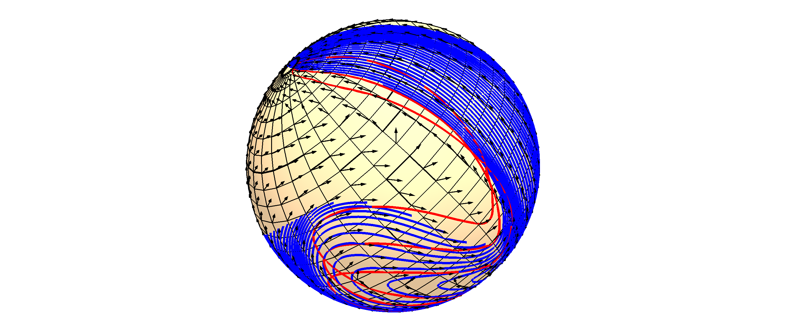
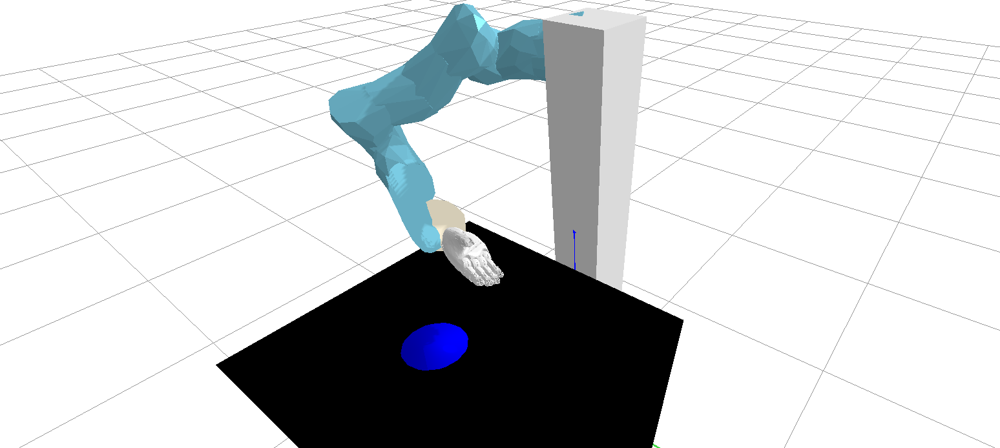

# Pytorch Implementation of Stable Vector Fields on Lie Groups.
The following code repository implements stable vector fields on Lie groups for robot motion generation and control.
Code repository in relation with ICRA RAL paper 'Learning Stable Vector Fields
on Lie Groups'.

[[Preprint]](https://arxiv.org/pdf/2110.11774.pdf)
[[Webpage]](https://sites.google.com/view/svf-on-lie-groups/?pli=1)


## Installation

Build Conda Environment

```angular2html
 conda env create -f environment.yml
```

activate environment and install library

```
pip install -e .
```

## Examples

### Learning Stable Vector Fields in S2 manifold
We visualize the globally stable vector field in the surface of a 3D sphere.

```angular2html
python scripts/s2_svf/test_s2_model/visualize_vector_field.py
```
### Learning Stable Vector Fields for planar peg-in-a-hole
We visualize the performance of a 5 DoF planar robot performing a peg-in-a-hole task by the combination of SE(2) stable vector field with Operational Space Control

```angular2html
python scripts/se2_svf/test_trained_models/load_and_test.py
```
### Learning Stable Vector Fields for pouring tasks
We visualize the performance of a 7 DoF robot arm perfoming a learned pouring task combining a SE(3) Stable Vector Field with an Operational Space Controller.

```angular2html
python scripts/se3_svf/test_trained_models/load_and_test.py
```

## References

[1] Julen Urain, Davide Tateo, Jan Peters. 
"Learning Stable Vector Fields on Lie Groups" 
RA-L 2022.
[[journal]](https://ieeexplore.ieee.org/stamp/stamp.jsp?arnumber=9935105)

```
@article{urain2022learning,
  title={Learning stable vector fields on lie groups},
  author={Urain, Julen and Tateo, Davide and Peters, Jan},
  journal={IEEE Robotics and Automation Letters},
  volume={7},
  number={4},
  pages={12569--12576},
  year={2022},
  publisher={IEEE}
}
```


### Contact

If you have any questions or find any bugs, please let me know: [Julen Urain](http://robotgradient.com/) julen[at]robot-learning[dot]de

